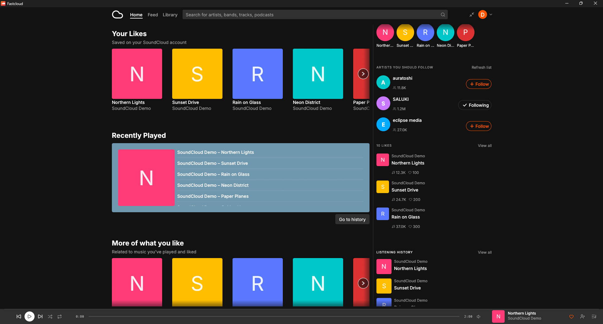
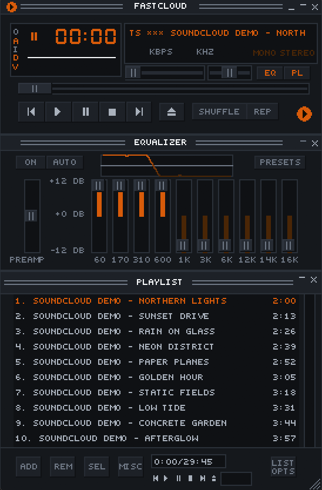

# Fastcloud

SoundCloud, native and fast. Fastcloud is a lightweight desktop client written
in Rust with egui. It plays music locally on Linux, macOS, and Windows without
embedding a browser engine.

[](https://github.com/COMF2222/fastcloud/actions/workflows/ci.yml)
[](https://github.com/COMF2222/fastcloud/releases)
[](LICENSE)



## What it does

- Plays public SoundCloud tracks locally through its own HLS pipeline, with
  seeking, gapless prefetch, shuffle, repeat, a disk cache, a ten-band
  equalizer, and a limiter.
- Opens likes, playlists, albums, profiles, the feed, listening history,
  related tracks, and stations. Search covers tracks, playlists, and people.
- Creates and edits playlists, likes tracks, follows artists, and supports
  drag and drop.
- Integrates with the desktop through media keys, now-playing metadata, global
  shortcuts, the system tray, and `soundcloud:` links.
- Runs as a classic Winamp-style mini player with `.wsz` skins, a spectrum
  analyzer, equalizer, and playlist window. Press `Ctrl+M` (`Cmd+Shift+M` on
  macOS).
- Includes an offline demo: `fastcloud --demo`.



## Download

Installers and portable archives are published on the
[GitHub Releases page](https://github.com/COMF2222/fastcloud/releases).

| Platform | Release file |
| --- | --- |
| Windows 10/11, x64 | `fastcloud-vX.Y.Z-windows-amd64-setup.exe` |
| macOS 12+, Apple Silicon | `fastcloud-vX.Y.Z-macos-arm64.dmg` |
| Debian/Ubuntu, x64 | `fastcloud-vX.Y.Z-linux-amd64.deb` |
| Other x64 Linux distributions | `fastcloud-vX.Y.Z-x86_64-unknown-linux-gnu.tar.gz` |

Portable Windows and macOS `.app` archives are published alongside the
installers. Every release includes `checksums.txt` with SHA-256 hashes.

The first public builds are not code-signed or notarized. Windows SmartScreen
and macOS Gatekeeper may therefore show an unknown-publisher warning. Do not
download Fastcloud from third-party mirrors; use this repository's Releases
page and verify the checksum.

### Build from source

Rust 1.95 or newer is required:

```sh
git clone https://github.com/COMF2222/fastcloud
cd fastcloud
cargo install --path . --locked
```

Linux also needs the GUI, audio, tray, and input development packages. On
Debian or Ubuntu:

```sh
sudo apt install libgtk-3-dev libasound2-dev libudev-dev libxdo-dev \
  libappindicator3-dev libpulse-dev libxkbcommon-dev
```

Arch users can build with [`packaging/PKGBUILD`](packaging/PKGBUILD). A
Homebrew cask template lives under [`packaging/Casks/`](packaging/Casks).

## Connect a SoundCloud account

Fastcloud cannot safely bundle a shared SoundCloud client secret in an
open-source executable. On first launch, press **Connect your SoundCloud
account**. Fastcloud follows SoundCloud's own application-registration flow:

1. SoundCloud opens in the browser and registers an API application for your
   account.
2. Fastcloud stores the returned client ID and secret in the operating
   system's keyring, never in a project file.
3. The browser opens once more so that the new application can access your
   profile, likes, playlists, and feed.

You do not need to copy keys or edit a config file. The two browser approvals
are separate because SoundCloud's registration token cannot access `/me`.

SoundCloud currently allows new API applications only for accounts with
[Artist Pro](https://checkout.soundcloud.com/artist/buy/artist-pro). This is a
SoundCloud restriction, not a Fastcloud subscription. The implementation
tracks SoundCloud's official
[`sc-api-auth`](https://github.com/soundcloud/api/blob/master/scripts/sc-api-auth.mjs)
flow.

If you already have an application, its redirect URI must be
`http://127.0.0.1:41317/callback`. You can provide it without storing anything
in the repository:

```sh
export FASTCLOUD_CLIENT_ID=…
export FASTCLOUD_CLIENT_SECRET=…
fastcloud
```

Without account authorization, an app token can still search and play public
tracks. Go+-only tracks require the listener's own Go+ subscription, and
rightsholder-blocked tracks may only expose a preview.

## Desktop controls

| Shortcut | Action |
| --- | --- |
| `Space` | Play or pause |
| `Ctrl+Left` / `Ctrl+Right` | Previous or next track |
| `Shift+Left` / `Shift+Right` | Seek ten seconds |
| `Ctrl+Up` / `Ctrl+Down` | Volume |
| `Ctrl+F` or `/` | Search |
| `Q` | Queue |
| `Ctrl+M` | Winamp mini player |
| `Ctrl+,` | Settings |

On macOS, use `Cmd` in place of `Ctrl`.

The CLI can also control a running instance:

```sh
fastcloud play
fastcloud next
fastcloud volume 40
fastcloud now-playing --raw
fastcloud https://soundcloud.com/artist/track
```

## Updates and releases

Pushing a `v*` tag runs the release workflow. It tests all three operating
systems, builds the installers and portable archives above, writes SHA-256
checksums, and creates the GitHub Release automatically. The exact maintainer
checklist is in [docs/releasing.md](docs/releasing.md).

Fastcloud does not yet update itself. A small in-app “update available” badge,
backed by the GitHub Releases API and checked at most once per day, is planned
after the final repository URL exists. Until then, watch the Releases page.

## SoundCloud API limits

The public API does not expose every feature of soundcloud.com. In particular,
there is no direct-message inbox, progressive MP3 endpoint, playlist snapshot
API, or Spotify-Connect equivalent. Recommendations and stations are assembled
from related tracks, likes, and history. See
[docs/soundcloud-api.md](docs/soundcloud-api.md) for the endpoint-level notes.

## Acknowledgements

Fastcloud was inspired by and started from the ideas and open-source work in
[Fastpotify on GitHub](https://github.com/crmne/fastpotify). Its polished
documentation is available at [fastpotify.rocks](https://fastpotify.rocks/).
Thank you to Carmine Paolino and the Fastpotify contributors for publishing
their work under the MIT License. The original copyright notice is retained in
[LICENSE](LICENSE), and the derived built-in Winamp skin carries its copy in
[`assets/skins/LICENSE-Fastpotify.txt`](assets/skins/LICENSE-Fastpotify.txt).

Fastcloud also uses [Inter](https://rsms.me/inter/) under the SIL Open Font
License and [Lucide](https://lucide.dev) icons under the ISC License. Their
license files are included with the assets.

Fastcloud is an independent project and is not affiliated with or endorsed by
SoundCloud. SoundCloud is a trademark of SoundCloud. Use of the API is subject
to SoundCloud's [API Terms of Use](https://developers.soundcloud.com/docs/api/terms-of-use).

## Contributing

See [CONTRIBUTING.md](CONTRIBUTING.md). Before opening a pull request, run:

```sh
cargo fmt --all -- --check
cargo clippy --all-targets --all-features --locked -- -D warnings
cargo test --all-targets --locked
```

Fastcloud is licensed under the [MIT License](LICENSE).
