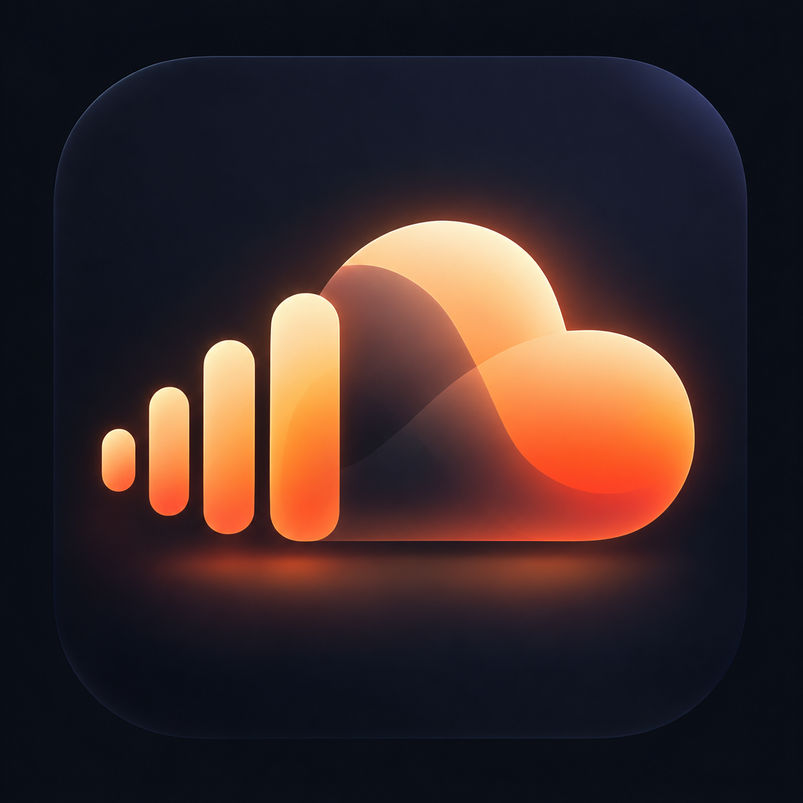
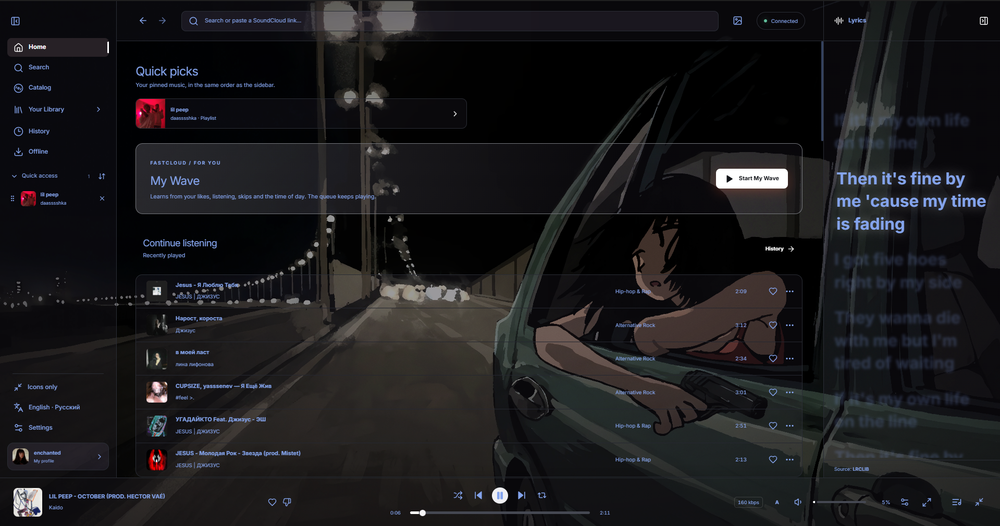
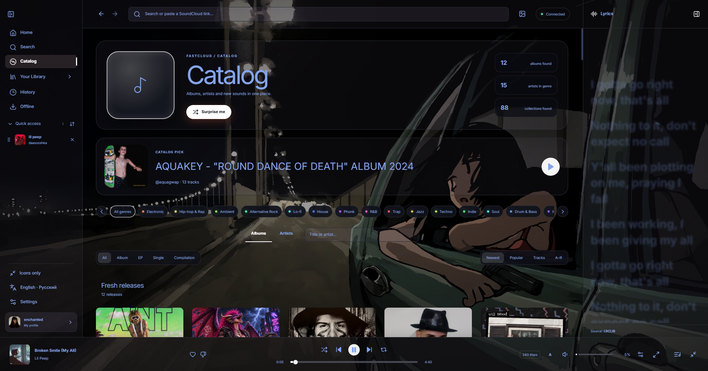
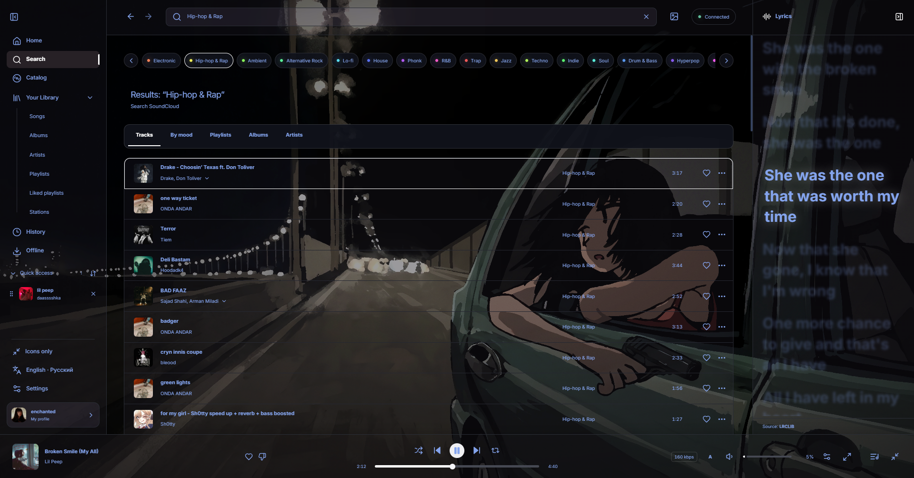
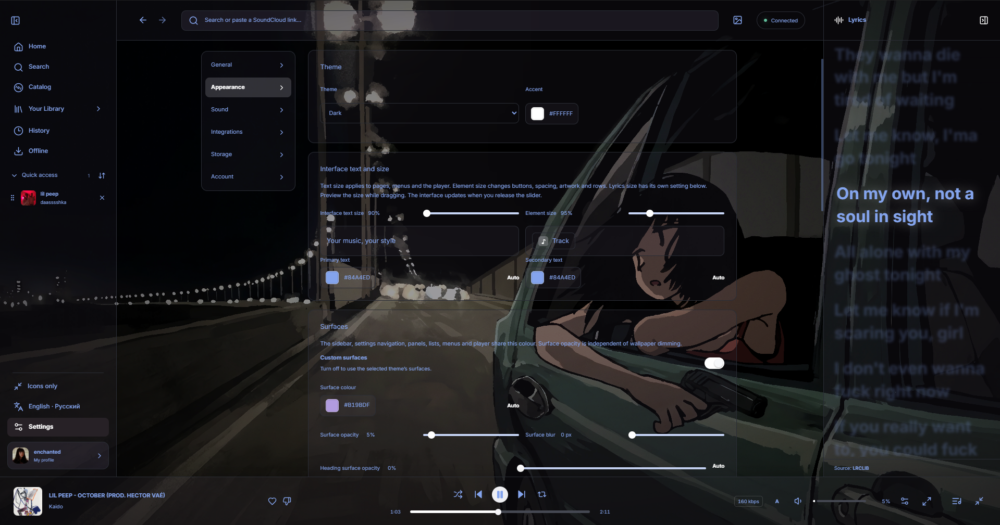
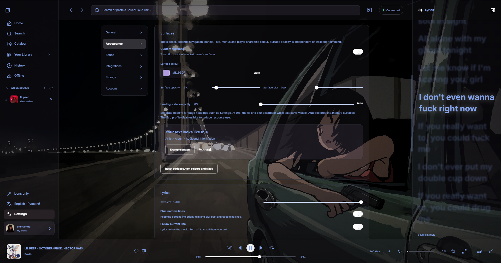
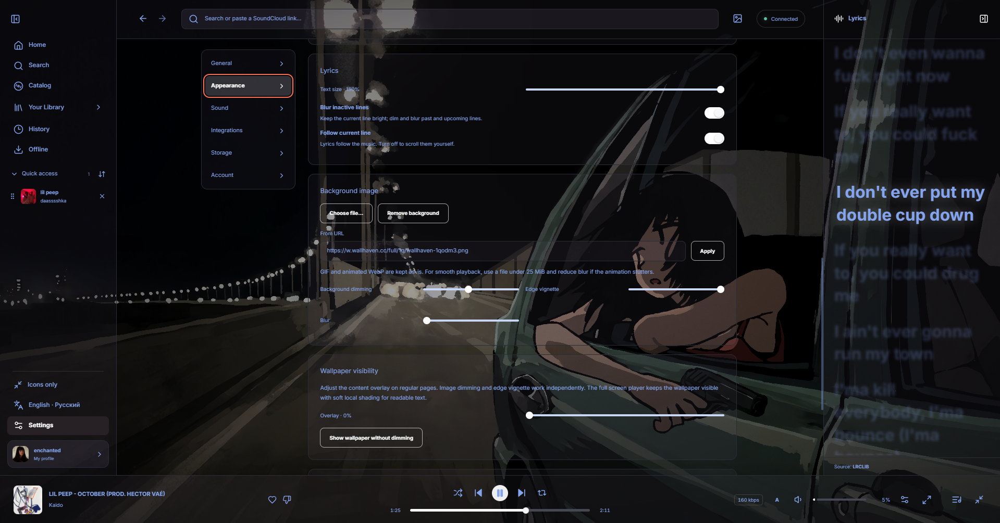
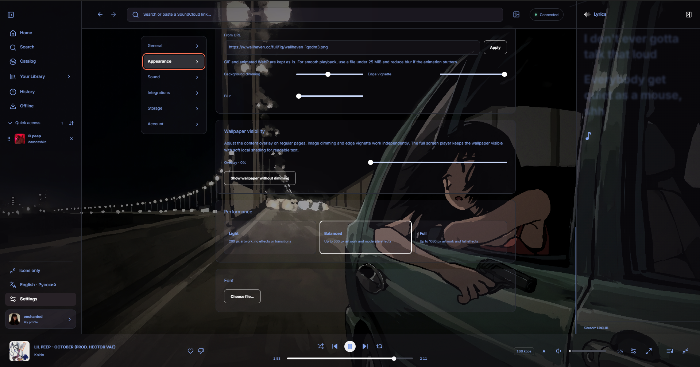

  

<h1 align="center">Fastcloud — SoundCloud на ПК</h1>

<strong>Твоя музыка. Твой плеер. Твоё оформление.</strong>

  <a href="https://github.com/COMF2222/fastcloud/releases/latest"><strong>Скачать для Windows</strong></a> ·
  <a href="https://fastcloud.comf.workers.dev/">Сайт и демо</a> ·
  <a href="https://fastcloud.comf.workers.dev/changes">Что нового</a> ·
  <a href="README.en.md">English</a>

  
  
  

**Fastcloud — бесплатный SoundCloud desktop-клиент для Windows** с текстами
песен, персональной волной и интерфейсом, который можно настроить под себя.
Слушай любимые треки, открывай свою библиотеку, переноси плейлисты Spotify
и выбирай, как выглядит твой плеер: от компактного Airwave до большого экрана
с обложкой и лириками.

Твоя библиотека, «Моя волна» и лирики — в одном окне. Скриншот из установленного приложения.

## Что внутри

| Возможность | Что получаешь |
| --- | --- |
| **Твоя библиотека** | Лайки, альбомы, плейлисты, подписки с поиском, закрепления и история. Дизлайки можно посмотреть, убрать или заменить лайком. |
| **«Моя волна»** | Подбор музыки по предпочтениям, лайкам и истории, с учётом дизлайков. Станции помогают найти похожее; с автопродолжением музыка играет дальше после конца альбома или плейлиста. |
| **Тексты песен** | Поиск в LRCLIB, Genius и lyrics.ovh; синхронные строки, когда они доступны. Лирики справа или в большом плеере. |
| **Оформление под себя** | Цвета, шрифты, размеры текста, прозрачность подложек, свои и анимированные фоны. Режим «только фон» скрывает интерфейс. |
| **Звук и управление** | Эквалайзер, баланс, скорость, повтор участка A–B, очередь, медиаклавиши и горячие клавиши. |
| **Чаты Fastcloud** | Переписка с друзьями по взаимной подписке SoundCloud: текст, музыка, непрочитанные, блокировка и архив. Оба собеседника должны пользоваться версией Fastcloud с чатами. |
| **Поделиться музыкой** | Кнопка на треке, альбоме, плейлисте и в плеере открывает выбор друга и добавляет музыку в черновик диалога. |
| **Импорт и интеграции** | Перенос лайков и плейлистов Spotify, импорт из Яндекс Музыки, Discord Rich Presence. |
| **Удобство на каждый день** | Мини-плеер Airwave, офлайн-загрузки, русский и английский интерфейс, обновления из приложения. |

В версии 0.4.0: папки плейлистов и подборки по правилам, личная статистика
в отдельном разделе, таймер сна, выравнивание громкости и плавные переходы между
треками. Последние изменения очереди можно отменить. Оформление, свои пресеты,
музыкальный вкус, закрепления, папки и дизлайки синхронизируются через аккаунт Fastcloud;
настройки также можно сохранить в JSON. Локальные файлы, устройство вывода звука
и данные входа в такую копию не попадают.

<strong>Каталог и поиск — посмотреть скриншоты</strong>

Открывай альбомы и исполнителей, выбирай жанр и находи новую музыку в каталоге.

Ищи треки, плейлисты, альбомы и исполнителей, не выходя из плеера.

## Музыка и текст на большом экране

Открой большой плеер, чтобы сосредоточиться на музыке: обложка, управление
воспроизведением и текст песни остаются рядом.

### Мини-плеер Airwave

Когда нужно больше места для других окон, переключись в Airwave кнопкой
в плеере или сочетанием **Ctrl+M**.

<strong>Оформление под себя — посмотреть настройки</strong>

Цвет текста и подложек, размеры интерфейса и прозрачность настраиваются отдельно.

Можно менять прозрачность заголовков и размер лирик.

Выбери свой фон и настрой его размытие, затемнение и видимость.

Профили производительности и собственный шрифт помогают подобрать интерфейс под компьютер.

## Скачать и начать слушать

1. Открой [последний релиз](https://github.com/COMF2222/fastcloud/releases/latest)
   и скачай **`Fastcloud_…_x64-setup.exe`** — полный установщик для Windows x64.
2. Установи Fastcloud и войди в свой SoundCloud-аккаунт через браузер.
3. Открой библиотеку, выбери трек или запусти «Мою волну».

Новые версии можно устанавливать прямо из приложения. Перед обновлением
кнопка **«Прочитать изменения»** покажет, что появилось в доступной версии.

Хочешь сначала посмотреть интерфейс? [Попробуй плеер на сайте](https://fastcloud.comf.workers.dev/#interactive-player)
с демонстрационной библиотекой.

## Несколько ответов перед установкой

### SoundCloud в России: нужен ли VPN?

После авторизации каталог, обложки и музыка проходят через сервер Fastcloud,
поэтому для прослушивания не требуется прямое подключение компьютера к
SoundCloud. Доступность страницы входа SoundCloud в браузере зависит от сети.

### Нужны ли Artist Pro или свои API-ключи?

Для обычного входа в Fastcloud — нет. Используй свой SoundCloud-аккаунт.
Доступ к Go+ и отдельным записям определяется правилами SoundCloud;
некоторые треки могут быть доступны только как фрагменты.

### Как работает импорт Spotify?

В настройках интеграций экспортируй лайки или плейлист через Exportify и
выбери полученный CSV/ZIP в Fastcloud. Можно также использовать файлы данных
аккаунта Spotify. Приложение ищет соответствующие записи в SoundCloud и
переносит найденные треки. [Подробнее об импорте](docs/spotify-import.md).

### Какие системы поддерживаются?

Готовые установщики публикуются для **Windows x64**. Интерфейс доступен на
русском и английском. Сборки для Linux и macOS пока не выпускаются.

## Помощь и участие

- [Документация и установка](https://fastcloud.comf.workers.dev/docs)
- [Ответы на частые вопросы](https://fastcloud.comf.workers.dev/faq)
- [Сообщить об ошибке или предложить функцию](https://github.com/COMF2222/fastcloud/issues)
- [Исходники, сборка и устройство приложения](docs/development.md)
- [Подготовка релизов](docs/releasing.md)

Fastcloud построен на **React, TypeScript, Tauri и Rust**. Исходный код открыт
под [лицензией MIT](LICENSE). Настройки и кэш хранятся на компьютере,
а токены аккаунта — в системном хранилище учётных данных.

Если Fastcloud пригодился, поддержи проект **звездой на GitHub** — так другим
слушателям будет проще его заметить.

Fastcloud — независимый неофициальный клиент, не связанный с SoundCloud.
